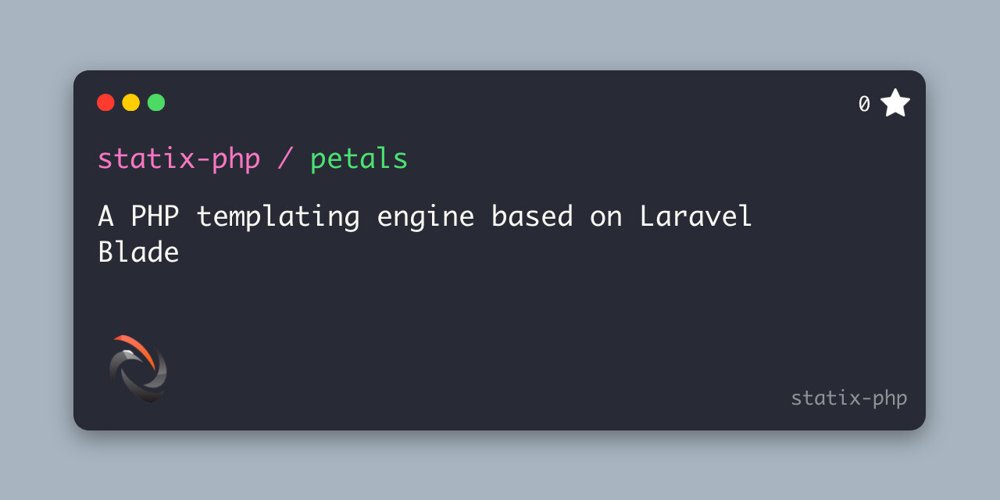

# A PHP templating engine based on Laravel Blade

[](https://packagist.org/packages/statix/petals)
[](https://github.com/statix-php/petals/actions/workflows/run-tests.yml)
[](https://packagist.org/packages/statix/petals)



Petals is a zero dependency PHP templating engine based on Laravel Blade. This was built as a fun experiment to play with ChatGPT and GitHub Co-pilot, between the two AI tools they wrote ~60% of the code.

## Installation

You can install the package via composer:

```bash
composer require statix-php/petals
```

## Usage

```php
use Statix\Petals\TemplatingEngine;

// require the composer autoloader
require __DIR__.'/vendor/autoload.php';

$engine = new TemplatingEngine(
    templates: __DIR__.'/templates',
    cachePath: __DIR__.'/cache',
);

// Render the templates/app.blade.php template
$content = $engine->render('app', [
    'message' => 'Hello world!',
]);

// Render the given string
$content = $engine->renderString('Hello {{ $name }}! The unix timestamp is {{ $time }}', [
    'name' => 'world',
    'time' => time(),
]);

// Compile the template to the cache directory, the compiled template will be used to render the template when render is called
$engine->compile('app');

// Compile the given string to the cache directory, if render is called on the same string, it will be rendered from the compiled cache template
$engine->compileString('Hello {{ $name }}! The unix timestamp is {{ $time }}');

// Clear the compiled templates
$engine->clearCache();
```

## Testing

```bash
composer test
```

## Formatting

```bash
composer format
```

## Changelog

Please see [CHANGELOG](CHANGELOG.md) for more information on what has changed recently.

## Credits

- [Wyatt Castaneda](https://github.com/statix-php)
- [All Contributors](../../contributors)

## License

The MIT License (MIT). Please see [License File](LICENSE.md) for more information.
